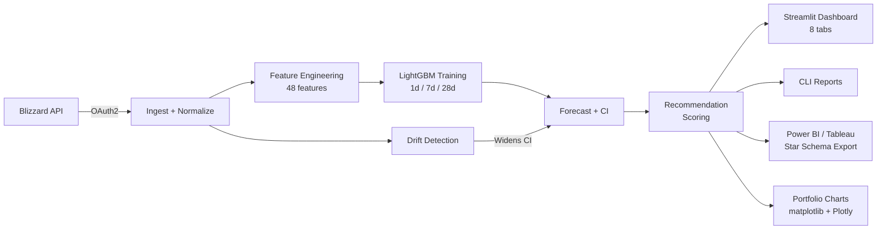

# WoW Economy Forecaster

[](https://github.com/RussellFeinstein/WoW-Economy-Forecaster/actions/workflows/ci.yml)


A **local-first ML forecasting system** for World of Warcraft auction house economy research.

Uses historical data from **The War Within (TWW)** to learn economy patterns, then applies category/archetype-based transfer learning to generate price, volatility, and sale-velocity forecasts for **Midnight** as it launches and matures.

---

## Key Technical Highlights

- **Archetype-based transfer learning** — economic behavior archetypes (not item IDs) power cross-expansion forecasting, enabling Day 1 predictions for never-seen items
- **Walk-forward backtesting** with leakage-free event handling — `WoWEvent.is_known_at()` prevents look-ahead bias
- **5-component recommendation scoring** — opportunity, liquidity, volatility, event_boost, uncertainty with principled thresholds
- **Adaptive confidence intervals** — drift detection widens CIs when market conditions shift; cold-start blending anchors predictions to source-expansion prices
- **Production-grade pipeline** — 39 CLI commands, 23 SQLite tables, 1,400+ tests, hourly automation

## Architecture



---

## Project Status

**Production-ready pipeline**

| Layer | Version | Status |
|---|---|---|
| v0.1.0 — Scaffold | Models, taxonomy, schema, CLI interfaces | Complete |
| v0.2.0 — Ingestion | BlizzardClient (live OAuth2), snapshot writer, item bootstrapper | Complete |
| v0.3.0 — Features | 48-column training Parquet, lag/rolling/event/archetype features | Complete |
| v0.4.0 — Backtesting | Walk-forward backtest, 4 baseline models, CSV/DB results | Complete |
| v0.5.0 — ML + Recommendations | LightGBM forecaster, 5-component scoring, buy/sell/hold ranking | Complete |
| v0.6.0 — Monitoring | Drift detection, adaptive CI, provenance, hourly orchestration | Complete |
| v0.7.0 — Reporting | CLI report commands, export layer, optional Streamlit dashboard | Complete |
| v0.8.0 — Source Governance | Source policies, preflight checks, freshness validation | Complete |
| v0.9.0 — Seed Events | 28 TWW seed events, category-level impact records | Complete |
| v1.0.0 — Automation | Scheduler daemon, Windows Task Scheduler integration | Complete |
| v1.1.0 — Normalization | Rolling z-score normalization with cold-start fallback | Complete |
| v1.5.0 — Crafting Advisor | Recipe seeder, margin compression/expansion, 6-window temporal analysis | Complete |
| v2.0.0 — Execution Layer | TSM export, check-data-health, hourly exit codes | Complete |
| v2.2.0 — Portfolio Showcase | Visualization layer, BI exports, Jupyter notebooks, CI pipeline | Complete |

---

## Architecture Overview

```
wow_forecaster/
├── taxonomy/        # Pure enums: EventType, ArchetypeCategory, ArchetypeTag
├── models/          # Pydantic v2 domain models (frozen/immutable value objects)
├── db/              # SQLite: connection, schema DDL (21 tables), migrations, repos
├── pipeline/        # 7 stages: ingest, normalize, feature_build, train,
│                    #           forecast, recommend, orchestrator (backtest separate)
├── ingestion/       # Blizzard live client, snapshot writer, item bootstrapper,
│                    # auctionator importer (backfill), cloud fetcher (GitHub Actions)
├── features/        # Daily agg, lag/rolling, event features, archetype features,
│                    # dataset builder → 48-col training / 45-col inference Parquet
├── backtest/        # Walk-forward splits, baseline models, metrics, reporter
├── ml/              # LightGBM: feature selector (37 cols), trainer, predictor
├── recipes/         # Blizzard recipe client, seeder, repo, margin calculator
├── recommendations/ # Scorer (5-component formula), ranker, reporter (CSV/JSON)
│                    # crafting_advisor: 6-window margin compression/expansion
├── monitoring/      # Drift detection, adaptive policy, health, provenance, reporter
├── reporting/       # Reader (file discovery + freshness), formatters (ASCII tables),
│                    # export (flat CSV/JSON for Power BI), BI star-schema export
├── governance/      # Source policy registry, preflight checks, freshness validation
├── viz/             # Publication-quality charts (matplotlib/seaborn/Plotly)
│   ├── theme.py     # WoW dark palette, apply_wow_theme(), Plotly template
│   ├── data_queries.py  # SQL/file -> pandas DataFrame fetchers
│   └── charts/      # 6 chart modules: forecast, backtest, feature, recommendation, drift, transfer
├── scheduler.py     # SchedulerDaemon (stdlib only) — hourly + daily automation
└── cli.py           # Typer CLI: 36 commands

config/
├── default.toml             # Static defaults (committed)
├── sources.toml             # 3 active source policies (blizzard_api, blizzard_news, auctionator)
└── events/
    ├── tww_events.json      # 28 TWW seed events
    └── tww_event_impacts.json  # 56 category-level impact records

data/
├── raw/snapshots/            # Hourly ingestion snapshots (JSON, gitignored)
│   ├── blizzard_api/YYYY/MM/DD/realm_{realm}_{ts}Z.json
│   ├── blizzard_news/YYYY/MM/DD/news_{ts}Z.json
├── processed/features/       # Training + inference Parquet + manifests
├── outputs/forecasts/        # forecast_{realm}_{date}.csv
├── outputs/recommendations/  # recommendations_{realm}_{date}.csv/.json
├── outputs/model_artifacts/  # LightGBM .pkl + .json artifacts
├── outputs/monitoring/       # drift_status, model_health, provenance JSON
├── outputs/backtest/         # Per-horizon backtest CSV + manifest
├── db/                       # wow_forecaster.db (SQLite)
└── logs/                     # forecaster.log

dashboard/                    # Optional Streamlit analysis UI
├── app.py                    # 8-tab dashboard (Top Picks/Forecasts/Volatility/Health/
│                             #   Status/Backtest/Feature Insights/Crafting)
└── data_loader.py            # Cached file loaders + DB queries

notebooks/                    # Jupyter analysis notebooks (portfolio narratives)
├── 01_eda_and_data_exploration.ipynb
├── 02_model_development.ipynb
└── 03_backtest_and_evaluation.ipynb

scripts/
├── run_backup.bat            # Daily durable-table backup to R2 (07:30)
├── run_daily.bat             # Daily pipeline wrapper (freshness gate + build + forecast)
├── run_healthcheck.bat       # Scheduled health check + failure alerting
├── run_hourly.bat            # Hourly refresh wrapper (stale-lock takeover guard)
└── setup_tasks.bat           # One-shot Windows Task Scheduler registration

tests/
├── test_backtest/        # Splits, models, metrics (60 tests)
├── test_cli/             # CLI smoke tests (54 tests)
├── test_db/              # Schema + repositories + migrations (37 tests)
├── test_events/          # Seed loader, event imports (24 tests)
├── test_features/        # Feature engineering, no-leakage (81 tests)
├── test_governance/      # Source policies, preflight, freshness (84 tests)
├── test_ingestion/       # Snapshots, event CSV, persistence (73 tests)
├── test_ml/              # Feature selector, LightGBM (44 tests)
├── test_models/          # Pydantic validation (61 tests)
├── test_monitoring/      # Drift, adaptive, orchestrator (73 tests)
├── test_pipeline/        # Pipeline interfaces, normalize (36 tests)
├── test_recipes/         # Recipe repo, seeder, margin calculator (21 tests)
├── test_recommendations/ # Scorer, ranker, item overlay, crafting (133 tests)
├── test_reporting/       # Reader, formatters, export (86 tests)
├── test_scheduler/       # Scheduler daemon (26 tests)
├── test_scripts/         # Bat wrappers: hourly lock guard, daily gate, health alerting, Windows-only (17 tests)
└── test_taxonomy/        # Taxonomy integrity (30 tests)
```

### Key Design Decisions

| Concern | Choice | Why |
|---|---|---|
| Data models | **Pydantic v2** (frozen) | Runtime validation, immutable value objects, clean serialization |
| Database | **Raw sqlite3** (no ORM) | Single-process local tool; SQL stays explicit |
| CLI | **Typer** | Type-annotation driven, auto-help, built on Click |
| Config | **tomllib + python-dotenv** | TOML for static config, .env for secrets |
| ML | **LightGBM** | Fast training, handles mixed types, interpretable feature importances |
| HTTP | **httpx** | Async-capable, used for Blizzard OAuth2 + API calls |
| Reporting | **CLI-first + optional Streamlit** | Terminal reports work headlessly; Streamlit is zero-cost when not needed |
| Tests | **pytest** | Standard; 1,000+ tests across 20 groups |

### Transfer Learning Architecture

The system does **not** do naive TWW-item → Midnight-item mapping. Instead:

1. **Archetype taxonomy** (`wow_forecaster/taxonomy/archetype_taxonomy.py`) defines 36 economic behavior tags (e.g. `consumable.flask.stat`, `mat.ore.common`).
2. **TWW items** are mapped to these archetypes via the item bootstrapper.
3. **Models train** on archetype-level time series from TWW.
4. **Archetype mappings** (`archetype_mappings` table) formally map each TWW archetype to its Midnight equivalent with a confidence score and required rationale.
5. As **Midnight data accumulates**, item-level models are trained and the archetype fallback gradually phases out.

### Event-Aware Forecasting

`WoWEvent.is_known_at(as_of: datetime)` is the look-ahead bias guard:
- Returns `False` if `announced_at is None` (conservative default).
- Returns `False` if `as_of < announced_at`.
- Forecasts only incorporate events that were publicly known at forecast time.

---

## Setup

### Requirements

- Python 3.11+
- Git
- Blizzard API credentials (Client ID + Client Secret)

### Install

```bash
git clone https://github.com/RussellFeinstein/WoW-Economy-Forecaster.git
cd WoW-Economy-Forecaster

python -m venv .venv
.venv\Scripts\activate          # Windows
# source .venv/bin/activate     # macOS / Linux

pip install -e ".[dev]"
```

### Initial Setup Sequence

```bash
# 1. Copy the env template and add your Blizzard API credentials
cp .env.example .env

# 2. Initialize the database (creates data/db/wow_forecaster.db)
wow-forecaster init-db

# 3. Validate your config
wow-forecaster validate-config

# 4. Fetch first commodity snapshot (required before item bootstrap)
wow-forecaster run-hourly-refresh

# 5. Seed item registry from Blizzard API (~2-5 min, ~9,950 items)
wow-forecaster bootstrap-items

# 6. Second refresh now inserts market observations (items table is populated)
wow-forecaster run-hourly-refresh

# 7. (Optional) Backfill 6-12 months of price history from Auctionator
wow-forecaster import-auctionator

# 8. Import TWW seed events (28 events) and build event features
wow-forecaster import-events
wow-forecaster build-events

# 9. Build feature datasets (requires build-events first)
wow-forecaster build-datasets
```

---

## CLI Reference

```
wow-forecaster --help
wowfc --help      # alias
```

### Database & Config

```bash
wow-forecaster init-db             [--db-path PATH] [--config PATH]
wow-forecaster validate-config     [--config PATH] [--full]
```

### Data Ingestion

```bash
# Fetch live commodity AH snapshot from Blizzard API
wow-forecaster run-hourly-refresh  [--realm SLUG] [--check-drift/--no-check-drift]

# Seed item registry from Blizzard Item API (~9,950 items; run once after first snapshot)
wow-forecaster bootstrap-items     [--concurrency N] [--db-path PATH]

# Import TWW seed events into wow_events table
wow-forecaster import-events       [--file PATH] [--dry-run]

# Backfill historical price history from Auctionator.lua SavedVariables
wow-forecaster import-auctionator  [--path PATH] [--realm SLUG]
```

### Events & Feature Datasets

```bash
# Build event features: seeds events + impacts -> DB + Parquet (run before build-datasets)
wow-forecaster build-events        [--realm SLUG ...] [--start-date DATE] [--end-date DATE]

# List events currently in the database
wow-forecaster list-events         [--limit N] [--expansion SLUG]

# Build training + inference Parquet datasets (requires build-events first)
wow-forecaster build-datasets      [--realm SLUG ...] [--start-date DATE] [--end-date DATE]

# Validate a dataset manifest
wow-forecaster validate-datasets   --manifest PATH [--strict]
```

### Forecasting Pipeline

```bash
# Full daily pipeline: train -> forecast -> recommend
# Freshness gate: refuses to run when the newest observation is older than
# 26 hours ([forecast] max_data_age_hours in config; 0 disables the gate)
wow-forecaster run-daily-forecast  [--realm SLUG] [--skip-train] [--skip-recommend]

# Train only
wow-forecaster train-model         [--realm SLUG ...]

# Forecast + recommend only (requires trained model)
wow-forecaster recommend-top-items [--realm SLUG] [--top-n N] [--forecast-run-id ID]
```

### Backtesting

```bash
wow-forecaster backtest            --start-date DATE --end-date DATE [--realm SLUG] \
                                   [--window-days N] [--step-days N] [--horizons 1,3]
wow-forecaster report-backtest     [--realm SLUG] [--run-id ID] [--horizon N]
```

### Monitoring

```bash
wow-forecaster check-drift         [--realm SLUG] [--output-json/--no-output-json]
wow-forecaster evaluate-live-forecast [--realm SLUG] [--window-days N]
```

### Database Backup

The durable tables (rollups, forecasts, recommendations, backtests, drift/health
snapshots, and reference data) are the part of the database that cannot be
regenerated once the underlying raw ages out of the 30-day window. `backup-durable-db`
writes a restorable `.db.gz` of everything except the two large per-observation
tables (recreated empty, so the file is a drop-in restore) and uploads it to a
separate, private R2 bucket. See [docs/db-backup.md](docs/db-backup.md) for the
design and restore steps.

```bash
# Build a local .db.gz and upload to the R2 backup bucket
wow-forecaster backup-durable-db       [--output-dir PATH] [--upload/--no-upload] \
                                       [--keep-local N]
```

**Setup (one time, on the machine that runs backups):**

1. Create a separate private R2 bucket (see [docs/db-backup.md](docs/db-backup.md)
   for the lifecycle recommendation).
2. Add the backup credentials to `.env` (see `.env.example`):
   `BACKUP_S3_ENDPOINT`, `BACKUP_S3_BUCKET`, `BACKUP_S3_ACCESS_KEY_ID`,
   `BACKUP_S3_SECRET_ACCESS_KEY`.
3. Install the upload dependency: `pip install -e ".[cloud]"`.
4. `scripts/setup_tasks.bat` registers `WoWForecaster-Backup` (daily 07:30). The
   scheduled health check (`run_healthcheck.bat`) then flags a stale backup via
   `check-data-health --backup-stale-hours 30`.

### Reporting

All report commands read already-written output files — they never re-run the pipeline.
Every report prints a `[FRESH]` or `[STALE]` banner so you can judge data currency at a glance.

```bash
# Top-N buy/sell/hold recommendations per category
wow-forecaster report-top-items    [--realm SLUG] [--horizon 1d|7d|28d] [--expansion SLUG] [--export PATH]

# Full forecast summary sorted by score
wow-forecaster report-forecasts    [--realm SLUG] [--horizon HORIZ] [--top-n N] [--export PATH]

# Volatility watchlist: items with widest CI bands (highest uncertainty)
wow-forecaster report-volatility   [--realm SLUG] [--top-n N] [--export PATH]

# Drift level + model health (retrain flag, MAE ratio per horizon)
wow-forecaster report-drift        [--realm SLUG] [--export PATH]

# Source freshness: per-source snapshot counts, success rates, stale flags
wow-forecaster report-status       [--realm SLUG] [--export PATH]

# LightGBM feature importance ranked by gain or split count
wow-forecaster report-feature-importance [--realm SLUG] [--horizon 1d|7d|28d] \
                                         [--top-n N] [--importance-type gain|split] \
                                         [--export PATH]

# DB-backed data collection health: coverage, gaps, freshness, plus a stale
# hourly-lock check and a retention sentinel (oldest raw row vs the 30-day
# ToS window). Exits 1 when any check fails. --backup-stale-hours (opt-in,
# 0 = off) also flags a durable backup older than N hours.
wow-forecaster check-data-health       [--realm SLUG] [--lookback-days 14] \
                                       [--stale-hours 4] [--backup-stale-hours 0]
```

**Common options for all report commands:**
- `--freshness-hours N` — threshold for `[STALE]` banner (default 4 h).
- `--export PATH` — write a flat CSV or JSON to *PATH* for Power BI / Excel.

### Source Governance

```bash
# List configured data sources and their enabled/disabled status
wow-forecaster list-sources

# Validate all source policies are internally consistent
wow-forecaster validate-source-policies

# Check freshness of each source's last successful snapshot
wow-forecaster check-source-freshness  [--realm SLUG] [--export PATH]

# Delete raw API data older than retention window (Blizzard API ToS §2.r — 30-day TTL)
wow-forecaster prune-snapshots         [--days N] [--dry-run]
```

### Crafting Margin Advisor

```bash
# Seed recipe data from Blizzard static API
# Default: most recent expansion (transfer_target in config, currently "midnight")
wow-forecaster seed-recipes        [--expansion SLUG] [--all] [--professions SLUG,...]

# Compute daily craft cost vs output price -> crafting_margin_snapshots
wow-forecaster build-margins       [--realm SLUG] [--days N]

# Report top crafting opportunities with 6 temporal windows
wow-forecaster report-crafting         [--realm SLUG] [--top-n N] [--export PATH]

# Recipe seeding status: counts by expansion+profession, reagent coverage, margin snapshot freshness
wow-forecaster report-recipe-status   [--expansion SLUG]

# Export item buy signals as a TSM import string (paste into TradeSkillMaster)
wow-forecaster export-tsm              [--realm SLUG] [--horizon 1d|7d|28d] \
                                       [--min-roi 0.10] [--output PATH]
```

**Crafting windows** (all valid buy <= sell pairs using existing 1d/7d/28d forecasts):
- `now -> now` — craft and sell today
- `now -> +7d` — buy mats today, sell next week
- `now -> +28d` — buy mats today, sell in 4 weeks
- `+7d -> +7d` — buy mats next week, sell next week
- `+7d -> +28d` — buy mats next week, sell in 4 weeks
- `+28d -> +28d` — buy mats in 4 weeks, sell then

### Automation

```bash
# Start foreground scheduler daemon (hourly refresh + daily forecast)
wow-forecaster start-scheduler     [--config PATH]

# Register Windows Task Scheduler tasks for unattended operation
# Tasks run silently (no visible cmd.exe window) via run_silent.vbs:
#   WoWForecaster-Hourly       run_hourly.bat, hourly at :16
#   WoWForecaster-Daily        run_daily.bat, daily at 07:00
#   WoWForecaster-HealthCheck  run_healthcheck.bat, every 6h at :45
scripts/setup_tasks.bat
```

The anchor minutes are deliberate: the hourly :16 avoids the daily-task
collision and Blizzard's top-of-hour snapshot refresh, and the health check's
:45 keeps it clear of the ingest so the two never read the database at the
same time. Re-running setup_tasks.bat is safe: it pins those anchors and
preserves the Disabled state of any task an operator has turned off.

All three tasks are registered with wake-to-run, so the machine may sleep
between runs: Task Scheduler wakes it for each trigger and Windows returns it
to sleep on the idle timeout after the run exits. This requires the active
power plan's "Allow wake timers" setting to be Enable (the Windows desktop
default); setup_tasks.bat checks it and prints the elevated powercfg fix if
the plan blocks wake timers. Know the boundary: wake timers cover sleep, and
hibernate on hardware that supports waking from it, but a powered-off machine
does not wake. Capture that survives power-off is what the cloud snapshot
workflow below provides.

The daily task gates itself on data freshness: run_daily.bat runs
`check-data-health --stale-hours 26` first and exits non-zero without
forecasting when ingestion is stale, so Task Scheduler records the failure
instead of silently forecasting from frozen data. The Streamlit dashboard
shows a red ingestion alert banner on every tab in the same condition.

A standalone health check makes failures impossible to miss without email
infrastructure: `scripts/run_healthcheck.bat` runs
`check-data-health --stale-hours 4`, appends output to logs/health.log, and on
failure writes `data/outputs/monitoring/health_alert.json` and raises a
persistent red console window (at most one per 24 hours). A healthy run clears
the alert. Its exit code mirrors check-data-health, so Task Scheduler's Last
Run Result doubles as a durable alert surface. setup_tasks.bat registers it as
the WoWForecaster-HealthCheck task.

These guards all trace back to one incident: a leaked lock file silenced
ingestion for 96 days in 2026 while every scheduled run reported success. The
full account, root cause chain, and fix set are in
[docs/postmortem-2026-04-lock-outage.md](docs/postmortem-2026-04-lock-outage.md).

### Cloud Snapshot Capture (GitHub Actions)

Hourly capture that does not depend on the desktop being on. A scheduled workflow
([.github/workflows/cloud-snapshot.yml](.github/workflows/cloud-snapshot.yml)) fetches
the commodities snapshot, gzips it (~59 MB raw -> ~2.2 MiB), and uploads it to a private
S3-compatible bucket (Cloudflare R2) whose 30-day lifecycle rule enforces the Blizzard
API ToS deletion window. The workflow is triggered by a Cloudflare Worker cron
([cloud-trigger/](cloud-trigger/)) that POSTs `workflow_dispatch` at :16 and :46, because
GitHub delivers only about 11 of 24 scheduled firings a day for this repo and cron density
does not change that. GitHub's own schedule is kept as a single :06 fallback that also acts
as a dead-man alarm. Design record, measured sizing, and failure modes:
[docs/cloud-capture.md](docs/cloud-capture.md).

One-time setup (repository owner):

1. Create a private R2 bucket with a 30-day delete lifecycle rule, and an API token
   scoped to that bucket with read and write access.
2. Add repository secrets: `BLIZZARD_CLIENT_ID`, `BLIZZARD_CLIENT_SECRET`,
   `SNAPSHOT_S3_ENDPOINT`, `SNAPSHOT_S3_BUCKET`, `SNAPSHOT_S3_ACCESS_KEY_ID`,
   `SNAPSHOT_S3_SECRET_ACCESS_KEY`.
3. Enable the workflow, which stays disabled until the secrets exist
   (`gh workflow enable "Cloud snapshot capture"` or the Actions tab), trigger the
   first run by hand (Run workflow), and confirm a ~2.2 MiB object lands in the bucket.
4. Deploy the trigger Worker so capture no longer relies on GitHub's schedule:
   create a fine-grained PAT scoped to this repo with the Actions permission set to
   read and write, then from [cloud-trigger/](cloud-trigger/) run
   `wrangler secret put GH_PAT` (paste the PAT) and `wrangler deploy`. Confirm
   dispatch runs appear at :16 and :46. Details: [cloud-trigger/README.md](cloud-trigger/README.md).

A failed run emails the repository owner; a healthy run also verifies that the
trailing 24 hours cover at least 20 distinct capture hours and fails loudly when
hours are being missed. Local catch-up ingestion
of the cloud backlog is tracked as issue #43 (`sync-snapshots`).

---

## Primary Workflow

```
run-hourly-refresh    # Blizzard API ingest -> normalize -> drift -> provenance
build-datasets        # feature engineering -> Parquet (requires build-events first)
run-daily-forecast    # train -> forecast -> recommend
```

`import-auctionator` = historical backfill only, not needed for ongoing hourly operation.

---

## Reporting Layer

### How Reports Work

The `wow_forecaster/reporting/` module has three components:

| Module | Purpose |
|---|---|
| `reader.py` | File discovery (`find_latest_file`), freshness checks (`check_freshness`), loaders for each report type |
| `formatters.py` | ASCII terminal table formatters — no third-party deps |
| `export.py` | Flat CSV/JSON export helpers; `flatten_recommendations_for_export()` expands nested score components into `sc_*` columns |

File discovery finds the **most recently modified** file matching the expected naming pattern, so reports from previous days are never silently used when a newer file exists.

### Freshness vs Staleness

Every formatter prints a provenance banner:

```
  [FRESH] Generated 1.2h ago
  [STALE] Generated 26.4h ago -- data may not reflect current market
  [AGE UNKNOWN] generated_at not available
```

### Export Format

`--export PATH.csv` writes flat rows with no nested dicts, ready for Power BI or pandas:

- **Recommendations**: `realm_slug, generated_at, run_slug, category, rank, archetype_id, horizon, target_date, current_price, predicted_price, ci_lower, ci_upper, roi_pct, score, action, reasoning, sc_opportunity, sc_liquidity, sc_volatility, sc_event_boost, sc_uncertainty, model_slug`
- **Forecasts**: same as forecast CSV + `ci_width_gold`, `ci_pct_of_price` derived columns
- **Drift**: raw JSON pass-through (for programmatic use)

---

## Optional Streamlit Dashboard

The `dashboard/` directory contains an optional local analysis UI that reads the same `data/outputs/` files as the CLI commands.

```bash
pip install -e ".[dashboard]"
streamlit run dashboard/app.py

# Override default realm:
streamlit run dashboard/app.py -- --realm area-52
```

**Five tabs:**

| Tab | Content | Data Source |
|---|---|---|
| Top Picks | Ranked recommendations per category, score breakdown, category/horizon filters | `recommendations_{realm}_{date}.json` |
| Forecasts | Full forecast table with CI width; archetype selector with historical price line + forecast overlay | `forecast_{realm}_{date}.csv` + SQLite |
| Volatility | Items sorted by CI width, CI% bar chart | `forecast_{realm}_{date}.csv` |
| Model Health | Drift level, uncertainty multiplier, MAE ratio per horizon, retrain flag | `drift_status_*.json` + `model_health_*.json` |
| Source Status | Per-source snapshot counts, success rates, data freshness vs report age | `provenance_{realm}_{date}.json` |

Freshness badges: Every tab shows a green/orange/red badge (`FRESH` / `STALE` / `NO DATA`). The threshold is configurable in the sidebar.

---

## Running Tests

```bash
# All 1,000+ tests
pytest

# With coverage
pytest --cov=wow_forecaster --cov-report=term-missing

# By group
pytest tests/test_recommendations/  # Scorer, ranker, item overlay, crafting advisor (160 tests)
pytest tests/test_cli/              # CLI smoke tests (54 tests)
pytest tests/test_governance/       # Source policies, preflight, freshness, pruner (100 tests)
pytest tests/test_reporting/        # Reader, formatters, export, TSM export, health (125 tests)
pytest tests/test_monitoring/       # Drift, adaptive, orchestrator (73 tests)
pytest tests/test_ingestion/        # Ingestion + snapshots (73 tests)
pytest tests/test_features/         # Feature engineering (81 tests)
pytest tests/test_backtest/         # Backtest framework (60 tests)
pytest tests/test_models/           # Pydantic validation (61 tests)
pytest tests/test_pipeline/         # Pipeline interfaces, normalize, item forecasts (68 tests)
pytest tests/test_ml/               # LightGBM training, inference, cold-start blending (81 tests)
pytest tests/test_scheduler/        # Scheduler daemon (26 tests)
pytest tests/test_db/               # Schema + repositories + migrations (37 tests)
pytest tests/test_events/           # Seed loader, event imports (24 tests)
pytest tests/test_taxonomy/         # Taxonomy integrity (30 tests)
pytest tests/test_recipes/          # Recipe repo, seeder, margin calculator (21 tests)
pytest tests/test_scripts/          # Bat wrappers: hourly lock guard, daily gate, health alerting, Windows-only (17 tests)
```

---

## Data Models

### Market Observations

| Model | Storage | Description |
|---|---|---|
| `RawMarketObservation` | SQLite + Parquet | Price data as received (copper int) |
| `NormalizedMarketObservation` | SQLite + Parquet | Gold-converted, rolling z-scored, outlier-flagged |

### Taxonomy

| Model | Description |
|---|---|
| `EventType` | 26 event categories (expansion launch → content drought) |
| `EventScope` | 4 scopes (global, region, realm_cluster, faction) |
| `EventSeverity` | 5 severity levels (critical → negligible) |
| `ArchetypeCategory` | 10 top-level economic categories |
| `ArchetypeTag` | 36 behavior-specific tags with category-prefix validation |

### Core Entities

| Model | Key Field | Description |
|---|---|---|
| `WoWEvent` | `announced_at` | Economy-affecting event with look-ahead bias guard |
| `EconomicArchetype` | `transfer_confidence` | Behavior grouping for cross-expansion transfer |
| `ArchetypeMapping` | `mapping_rationale` (required) | Explicit TWW→Midnight transfer map |
| `ForecastOutput` | `confidence_lower/upper` | Point forecast with CI |
| `RecommendationOutput` | `action`, `priority` | buy/sell/hold/avoid with urgency rank |
| `RunMetadata` | `config_snapshot` | Full audit record for reproducibility |

---

## SQLite Schema (21 tables)

```
item_categories               Item hierarchy (slug-based, expansion-aware)
economic_archetypes           36 behavior tags with transfer_confidence
items                         WoW item registry (item_id -> archetype_id FK)
market_observations_raw       Raw AH snapshots (copper, pre-normalization)
market_observations_normalized Gold-converted, rolling z-scored, outlier-flagged
archetype_mappings            TWW -> Midnight transfer map (rationale required)
wow_events                    Economy events with announced_at bias guard
event_archetype_impacts       Event x archetype impact direction/magnitude/lag
event_category_impacts        Event x category impact (no archetype FK; uses category string)
model_metadata                Trained model registry (slug, type, artifact_path)
run_metadata                  Pipeline execution audit (config_snapshot, status)
forecast_outputs              Point forecasts with CI bounds
recommendation_outputs        buy/sell/hold/avoid with score components
ingestion_snapshots           Snapshot metadata (source, hash, record_count)
backtest_runs                 Backtest invocation metadata (window, folds)
backtest_fold_results         Per-prediction backtest results
drift_check_results           Drift detection results (level, uncertainty_mult)
model_health_snapshots        Live MAE vs backtest baseline per horizon
recipes                       Blizzard recipe registry (profession, output item, expansion)
recipe_reagents               Required reagents per recipe (qty, required type only)
crafting_margin_snapshots     Daily craft cost vs sell price margin per recipe+realm
```

---

## Score Formula

Recommendations are ranked by a 5-component composite score:

```
score = 0.35 x opportunity
      + 0.20 x liquidity
      - 0.20 x volatility
      + 0.15 x event_boost
      - 0.10 x uncertainty
```

Actions:
- **buy** — predicted ROI >= 10%
- **sell** — predicted ROI <= -10%
- **avoid** — CI width > 80% of price OR coefficient of variation > 80%
- **hold** — otherwise

`event_boost` is clamped to `[-100, 100]` — negative impacts penalize the score.
`top_n_per_category` deduplication: best-scoring horizon per archetype_id (tie: shorter horizon wins).

---

## Feature Columns

The dataset builder produces two Parquet files per run:

| File | Columns | Description |
|---|---|---|
| Training | 48 | All features + 3 forward-looking target columns (`target_price_1d/7d/28d`) |
| Inference | 45 | Same minus target columns (no leakage) |

**Feature groups:** price (9), volume (3), lag (5), rolling (6), momentum (3), temporal (4), event (8), archetype (5), transfer (2), target (3 — training only).

The ML model uses **37 input features** (subset of inference columns, selected by `wow_forecaster/ml/feature_selector.py`).

---

## Pipeline Stages

| Stage | Class | Description |
|---|---|---|
| Ingest | `IngestStage` | Live Blizzard API -> raw observations -> snapshots |
| Normalize | `NormalizeStage` | Copper->gold, rolling z-score (30-day window), outlier flag |
| Feature Build | `FeatureBuildStage` | 48-col Parquet (lag/rolling/event/archetype features) |
| Train | `TrainStage` | LightGBM cross-archetype model per horizon (1d/7d/28d) |
| Forecast | `ForecastStage` | Inference + heuristic CI with adaptive drift multiplier |
| Recommend | `RecommendStage` | 5-component scoring, top-N per category, CSV/JSON output |
| Backtest | `BacktestStage` | Walk-forward with 4 baseline models |
| Orchestrator | `HourlyOrchestrator` | 7-step hourly pipeline with drift + provenance |

---

## Source Governance

`config/sources.toml` defines 3 source policies:

| Source | Status | Notes |
|---|---|---|
| `blizzard_api` | **Enabled** | Live commodity + realm AH data via OAuth2 |
| `blizzard_news` | Enabled | Patch notes + hotfix RSS feed |
| `auctionator` | Enabled | Local SavedVariables backfill (no HTTP) |

`wow_forecaster/governance/preflight.py` runs 3 checks before each ingest: source enabled, not on cooldown, freshness threshold not exceeded.

---

## Seed Events

`config/events/tww_events.json` contains 28 TWW events covering expansion launch, season starts/ends, RTWFs, major patches, holiday events, and content droughts.

`config/events/tww_event_impacts.json` contains 56 category-level impact records mapping event type + category to expected price-change magnitude and direction.

Run `wow-forecaster build-events` to load these into the database before building datasets.

---

## Configuration

All settings in `config/default.toml`. Override locally with:
1. `config/local.toml` (gitignored) — local path overrides
2. `.env` (gitignored) — secrets and env-specific overrides
3. `WOW_FORECASTER_*` environment variables

Key sections: `[database]`, `[expansions]`, `[realms]`, `[pipeline]`, `[forecast]`, `[features]`, `[model]`, `[monitoring]`, `[backtest]`, `[logging]`, `[governance]`, `[crafting]`.

### Credentials (.env)

```
BLIZZARD_CLIENT_ID=...       # required for live Blizzard AH data
BLIZZARD_CLIENT_SECRET=...   # required for live Blizzard AH data
```

Without Blizzard credentials the pipeline cannot ingest live data.

---

## Related Projects

- **[alt-army-guide](https://github.com/RussellFeinstein/alt-army-guide)** — Step-by-step guide for setting up Alchemy + Enchanting alts to execute on this system's recommendations. Craft targets (Light's Potential, Enchant Chest - Mark of the Worldsoul) were selected using this forecaster's margin analysis.

---

## What's Not Implemented Yet

- `top_n_per_category` V2 refinements: Pareto-frontier ranking, user-profile weighting, "do not recommend" blocklist, A/B test support. (Cross-horizon deduplication was implemented in v0.9.1.)
- Source governance: per-source cooldown enforcement — the cooldown check logic exists in `preflight.py` but `orchestrator.py` never queries or passes `last_call_at`, so the check is always skipped.
- Live news ingestion: `BlizzardNewsClient.fetch_recent_news()` is implemented but `IngestStage._fetch_news()` always calls fixture mode regardless of credentials.
- News-to-event auto-detection: `extract_wow_events()` (mapping ingested news items to `WoWEvent` candidates) is not implemented.

---

## Development

```bash
# Install dev dependencies
pip install -e ".[dev]"

# Lint
ruff check wow_forecaster/ tests/

# All tests with coverage
pytest --cov=wow_forecaster --cov-report=term-missing

# Run a specific test group
pytest tests/test_recommendations/ -v
```
